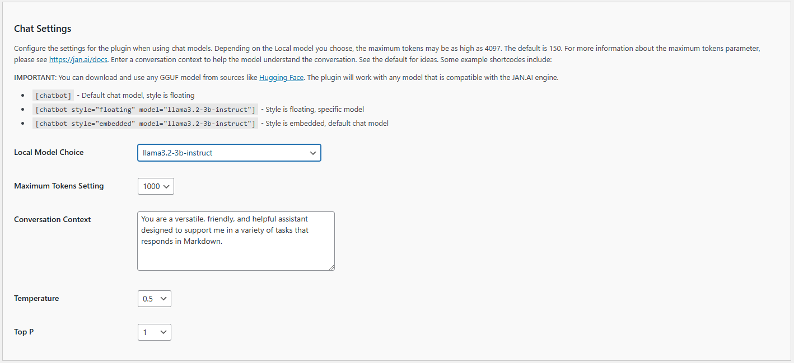

# Configuring Chat Settings

To ensure your Kognetiks Chatbot functions optimally, you need to configure the chat settings appropriately. Here's a detailed guide on how to use these settings:



1. **Local Server Model Default**:
   - **Description**: This setting allows you to choose the default Local Server model your chatbot will use.
   - **Options**: Depending on the available models, you can select from various options such as `llama3.2-3b-instruct`, etc.
   - **How to Set**: Select the desired model from the dropdown menu. For instance, `llama3.2-3b-instruct`.

2. **Maximum Tokens Setting**:
   - **Description**: This setting determines the maximum number of tokens (words and parts of words) the model can use in a single response. This helps control the length and detail of the responses.
   - **Default Value**: The default is set to 150 tokens, but it can be increased up to 4097 tokens.
   - **How to Set**: Enter the desired number of tokens in the provided field. For example, `1000`.

3. **Conversation Context**:
   - **Description**: This field is used to set the context for the conversation, helping the model understand the nature and tone of interactions.
   - **Default Example**: "You are a versatile, friendly, and helpful assistant designed to support me in a variety of tasks."
   - **How to Set**: Enter a suitable conversation context that matches the intended use of the chatbot.

4. **Temperature**:
   - **Description**: This setting controls the randomness of the model's responses. A lower value (closer to 0) makes the output more focused and deterministic, while a higher value (closer to 1) makes it more random and creative.
   - **Default Value**: The default is set to 0.5.
   - **How to Set**: Use the dropdown menu to select a value between 0 and 1.

5. **Top P**:
   - **Description**: This setting, also known as "nucleus sampling," controls the diversity of the responses. It considers the smallest possible set of words whose cumulative probability is greater than or equal to the value of `Top P`.
   - **Default Value**: The default is set to 1.
   - **How to Set**: Use the dropdown menu to select a value between 0 and 1.

## Example Shortcodes

- **Default Chat Model**:
  ```
  [chatbot]
  ```
  - **Description**: Uses the default chat model with a floating style.
  
- **Floating Style, Specific Model**:
  ```
  [chatbot style="floating" model="llama3.2-3b-instruct"]
  ```
  - **Description**: Uses a floating style with a specified model (`llama3.2-3b-instruct` in this case).

- **Embedded Style, Default Chat Model**:
  ```
  [chatbot style="embedded" model="llama3.2-3b-instruct"]
  ```
  - **Description**: Uses an embedded style with the default chat model.

## Steps to Configure

1. Navigate to the Chat Settings section of the Kognetiks Chatbot plugin in your WordPress dashboard.

2. Select the default chat model from the dropdown menu.

3. Enter the maximum tokens setting appropriate for your needs.

4. Provide a clear and concise conversation context to guide the chatbot's interactions.

5. Adjust the temperature setting to control the creativity of the responses.

6. Adjust the Top P setting to manage the diversity of the responses.

7. Save the settings.

## Tips

- **Adjusting Token Limits**: Higher token limits can result in more detailed responses but also increase API usage.

- **Experiment with Temperature and Top P**: Fine-tuning these settings can help you achieve the desired balance between response creativity and coherence.

- **Context Matters**: Providing a well-defined conversation context can significantly improve the relevance and helpfulness of the chatbot's responses.

By following these steps and tips, you can ensure that your Kognetiks Chatbot is set up effectively to meet your needs.

---

- **[Back to the Overview](/overview.md)**