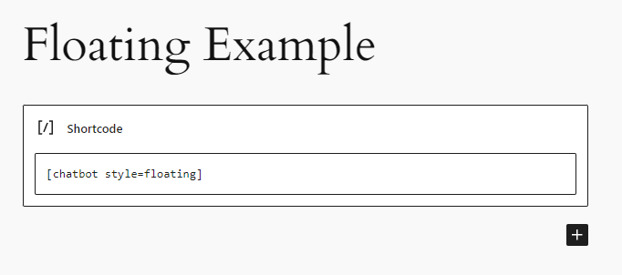
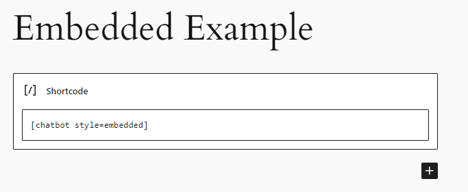

# Getting Started

1. Obtain your API key by signing up at https://platform.openai.com/account/api-keys.

2. Install and activate the Chatbot plugin.

3. Navigate to the settings page (Settings > API/Model) and enter your API key.

4. Customize the chatbot appearance and other parameters as needed.

5. Add the chatbot to any page or post using the provided shortcode: ```[chatbot_chatgpt]```

Now your website visitors can enjoy a seamless and personalized chat experience powered by OpenAI’s ChatGPT API.

# Installation

1. Upload the ‘chatbot-chatgpt’ folder to the ‘/wp-content/plugins/’ directory.

2. Activate the plugin through the ‘Plugins’ menu in WordPress.

3. Go to the ‘Settings > Chatbot’ page and enter your OpenAI API key.

4. Customize the chatbot appearance and other parameters as needed.

5. Add the chatbot to any page or post using the provided shortcode: ```[chatbot_chatgpt]```

6. Chatbot now support either an embedded chatbot or floating chatbot.

7. Use ```[chatbot_chatgpt]``` or ```[chatbot style="floating"]``` to display the chatbot as a floating chatbot.

8. Use ```[chatbot style="embedded"]``` to display the chatbot as an embedded chatbot.

9. By default, the chatbot will appear in the lower right corner of the page. This is adjustable in the .css file but not recommended for the causal site builders.

# Floating Chatbot Example



# Embedded Chatbot Example



---

- **[Back to the Overview](/overview.md)**
