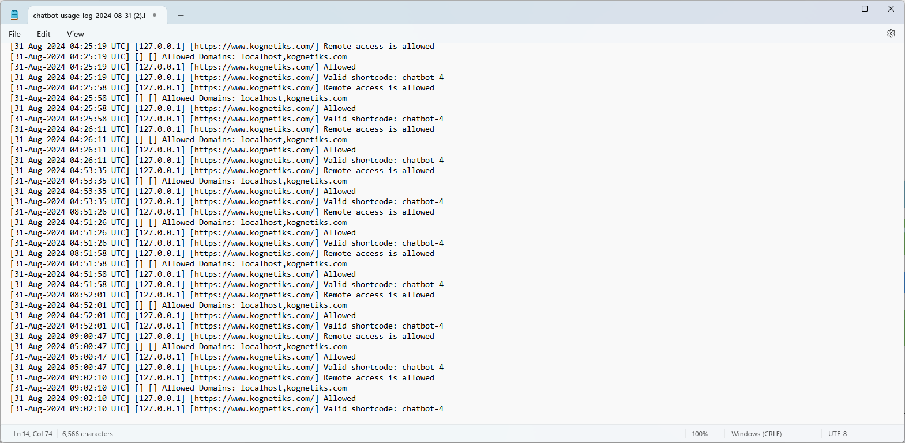

# Tools

This tab provides tools, tests and diagnostics that are enabled when the Chatbot Diagnostics are enabled on the ```Messages``` tab.

There are three tools currently available:

- Options Exporter
- Manage Error Logs
- Manage Widget Access Logs

Each tool is briefly described below.

---

## Options Exporter

Export the Chatbot options to a file.  This excludes sensitive information such as your API key.


### Steps:

1. **Download Options Data**:
   - Use the ```Download Options Data``` button to retrieve the chatbot options and download the file.

---

## Manage Error Logs:

The Manage Error Logs section provides direct access to the chatbot's unique errors.  If you're experiencing a problem with the chatbot, please check the error logs to see if you can determine what might be the problem.


## Example Error Log


### Steps:

1. **Download**
    - Choose ```Download``` to retrieve and save locally the selected error log.

2. **Delete**
    - Choose ```Delete``` to delete the selected error log.

3. **Delete All**
    - Chose ```Delete All``` to delete ALL error logs listed.

---

## Manage Widget Access Logs:

The Manage Widget Access Logs section provides direct access to the chatbot's widget usage by remote sites.  If you've enabled access via a remote widget, and enabled logging to the widget, these logs will record allowed and disallowed access to whitelisted domains and OpenAI Assistants.


## Example Widget Log



### Steps:

1. **Download**
    - Choose ```Download``` to retrieve and save locally the selected widget access log.

2. **Delete**
    - Choose ```Delete``` to delete the selected widget access error log.

3. **Delete All**
    - Chose ```Delete All``` to delete ALL widget access logs listed.

---

- **[Back to the Overview](/overview.md)**
